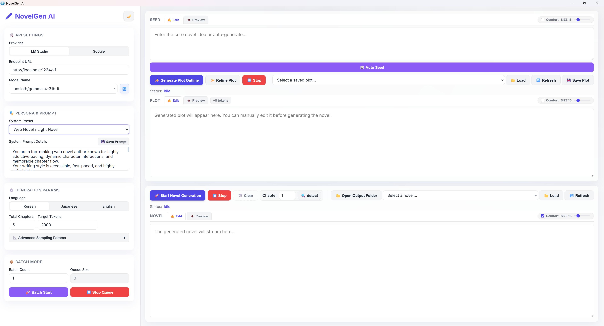

# 🖋️ NovelGen AI

NovelGen AI is a powerful, standalone AI novel generator built with **Rust** and **Tauri**. It is the desktop evolution of the original Python-based AI Novel Generator, designed to provide a premium, native experience for immersive story creation.



## ✨ Key Features

- **Standalone Executable**: Runs entirely as a local desktop app without needing a background Python environment or web server.
- **Dual Provider Support**: Seamlessly switch between local models via **LM Studio** and cloud models via **Google Gemini API**.
- **Context-Aware Streaming**: Streams chapter generation intelligently using hierarchical chapter summarization and sliding window context to maintain narrative logic without hitting token limits.
- **Multi-language Support**: Generate stories in **Korean**, **Japanese**, or **English**.
- **Interactive Plot Management**: 
  - **AI-powered Seed Generation**: Instantly brainstorm creative story ideas based on your chosen writing style.
  - **Detailed Plot Outlines**: Generate comprehensive plot structures.
  - **Creative Refinement**: Use the **✨ Refine Plot** feature to add emotional depth, sensory details, and polished pacing.
  - **Token Usage Monitoring**: Real-time **Plot Token Count** estimation using a CJK-optimized algorithm to help manage context window usage.
  - **Local Storage**: Securely save, load, and edit plot outlines as local text files.
- **Batch Queue Management**: Add multiple generation tasks to a queue. The system processes them sequentially, allowing for high-volume content creation.
- **Robust Resumption**: Automatically detect the last written chapter and resume generation with full context awareness.
- **Flexible Text Import**: Drag and drop `.txt` files directly into **System Prompt Details**, **Seed**, **Plot**, and **Novel** panes to load content instantly.
- **Reading Comfort Controls**: Each **Seed / Plot / Novel** preview has its own font size slider and optional **Comfort** mode with a soft paper-like background for long reading sessions.
- **Adaptive Theme Support**: Switch between **Light** and **Dark** mode from the sidebar with a single click. The selected theme is remembered and also syncs the native window title bar on supported systems.
- **Modern Aesthetics**: A stunning, glassmorphism-inspired interface with real-time **Markdown Preview**, **KaTeX (LaTeX)** mathematical formula rendering, and **Automatic Word Wrap** for both plots and novel content.

## 🛠️ Technology Stack

- **Frontend**: Vanilla HTML / CSS / JavaScript (Lightweight & Fast)
- **Backend**: Rust 🦀 (Safety & Performance)
- **App Framework**: [Tauri V2](https://v2.tauri.app/)
- **State Management**: Local persistence via `localStorage` and native File System.

## 🚀 Getting Started

### 📥 Download
You can download the latest version from the [Releases Page](https://github.com/kirinonakar/Novelgen/releases).

### Manual build
### Prerequisites

1. **[Node.js](https://nodejs.org/)** (v18 or higher)
2. **[Rust](https://www.rust-lang.org/tools/install)** & Cargo (Required for building from source)
3. **AI Provider**:
   - **LM Studio**: Local server running on port `1234`.
   - **Google Gemini**: A valid API key (automatically loaded from `gemini.txt`).

### Installation (Development)

1. Clone or download this project folder.
2. Navigate to the project directory:
   ```bash
   cd Novelgen
   ```
3. Install dependencies:
   ```bash
   npm install
   ```
4. Launch the application:
   ```bash
   npm run tauri dev
   ```

### Build Standalone Executable

To package the app into a single native installer or executable:
```bash
npm run tauri build
```
The final binary will be located in `src-tauri/target/release`.

---

## 💻 Runtime Requirements

To run the application (without building from source), ensure the following are available:

### Windows
- **Microsoft Edge WebView2**: Required for the UI to render.
  - Windows 11: Pre-installed.
  - Windows 10: Usually pre-installed via Edge updates.
  - If the app fails to launch, download and install it from [Microsoft's official site](https://developer.microsoft.com/en-us/microsoft-edge/webview2/).

### AI Backend (Required for generation)
One of the following providers must be accessible:
- **LM Studio**: Must be running a local server on port `1234`.
- **Google Gemini API**: A valid API Key and active internet connection.

---

## 📖 Narrative Generation Workflows

You can generate your novel using two distinct workflows:

### Workflow A: Manual Full-Control (Recommended)
This mode allows you to refine the story's direction before final generation.
1.  **Input Initial Idea**: Enter a brief concept in the "Plot Seed" box, or click **🎲 Auto Seed** to let the AI brainstorm a unique starting point.
2.  **Generate Plot**: Click **Generate Plot Outline**. The AI will create a chapter-by-chapter summary.
3.  **Refine Plot (Optional)**: Click **✨ Refine Plot**. The AI will act as a master story architect to elaborate on the outline, adding emotional depth and vivid sensory details.
4.  **Review & Edit**: You can manually edit the generated plot directly in the UI to fix inconsistencies.
5.  **Save Plot**: Use the **💾 Save Plot** button to store your outline locally in `output/plot/`.
6.  **Start Generation**: Click **Start Novel Generation**. The AI will follow your plot exactly, chapter by chapter.

### Workflow B: Automated Batch Mode
Perfect for creating multiple variations or generating large volumes of content automatically.
1.  **Input Idea & Batch Count**: Enter your initial idea and the number of independent novels you want to create.
2.  **Launch**: Click **Batch Start**.
3.  **Automatic Execution**: The system will automatically:
    - Generate a unique plot outline for each batch.
    - Start generating the novel based on that specific plot.
    - Save each completed novel and its metadata in the `output/` directory.
4. **Queue Management**: New requests are added to a queue and processed sequentially.

---

## ⚙️ Configuration & Advanced Settings

### System Prompt (`system_prompt.txt`)
Define the global persona, tone, and constraints of your AI novelist.
- Use the **System Preset** dropdown to quickly switch between styles (Standard, Web Novel, Epic Fantasy, Romance, Sci-Fi).
- Click the **Save** icon to persist your custom prompt to `system_prompt.txt`.
- Drag and drop a `.txt` file into **System Prompt Details** to load prompt text instantly.
- Selecting **Custom (File Default)** reloads the saved contents of `system_prompt.txt`.

### Generation Parameters
Adjust these in the sidebar for fine-grained control:
- **Temperature**: Higher values (e.g., 1.2) increase creativity; lower values (e.g., 0.5) make output more focused.
- **Top-P**: Controls the diversity of the vocabulary.
- **Repetition Penalty**: Helps prevent the model from repeating phrases or sentences.

### Preview, Import, and Theme Tools
- Drag and drop `.txt` files into the **Seed**, **Plot**, and **Novel** editors to replace the current text quickly.
- Each **Seed / Plot / Novel** preview includes an independent font size slider for easier editing and proofreading.
- Enable the **Comfort** checkbox beside each preview font slider to use a softer reading surface designed for long-form review.
- Use the theme toggle beside the **NovelGen AI** title in the sidebar to switch the whole app between light and dark appearance.

### Context Management
NovelGen AI maintains long-term continuity using a sophisticated **layered memory architecture**, allowing it to generate cohesive novels of any length:

1.  **Global Plot Outline**: The full refined plot is always included in the context, ensuring the AI adheres to the master plan and reaches the intended climax.
2.  **Recent Chapter Summaries**: A sliding window of the **last 4 chapter summaries** provides high-density context for immediate narrative flow.
3.  **Layered Story State**:
    *   **Facts**: Established canon facts that must remain consistent.
    *   **Open Threads**: Unresolved plot points and "to-do" items for the narrative.
4.  **Character Status Memory**: Dynamically tracks character locations, emotional states, and evolving relationships.
5.  **Narrative Arc Management**:
    *   **Current Arc**: The immediate conflict or goal being pursued in the present chapters.
    *   **Closed Arcs**: Summarized history of finished story arcs, allowing for long-term recall without wasting tokens.
6.  **Sliding Prose Window**: The final ~1,200 characters of the previous chapter are provided to ensure seamless transitions and consistent writing style.
7.  **Style & Expression Cooldown**: An automated trope-detection system that prevents the AI from overusing specific transition phrases or descriptive clichés in narration.

### Recommended Context Length
If your model runner allows changing context length, these settings work well in practice:
- **Short plot outlines**: `16k` to `24k` context is usually enough.
- **General long-form novel generation**: `32k` context is the recommended default.

## 📄 License

This project is licensed under the MIT License - see the [LICENSE](LICENSE) file for details.
